# Phase 6E & 6F: ACK Synchronization and Reconciliation Specification

## 1. Current Backend Contract Status

The current SIH26001 backend specification defines the following endpoints:
- `GET /health`: Basic health check (`{"status": "ok"}`).
- `GET /api/v1/alerts`: List of authoritative emergency alerts.

**The SIH26001 backend does NOT currently define an HTTP endpoint, protocol, or wire contract for operational acknowledgements (ACKs).**

Specifically, the backend contract currently lacks:
- HTTP method (e.g. `POST`, `PUT`, `PATCH`)
- URL route (e.g. `/api/v1/alerts/{alert_id}/ack`)
- Request schema / payload (e.g. client timestamp, device metadata, user token)
- Response schema / payload (e.g. server confirmation ID, server timestamp)
- Authentication and authorization requirements (e.g. Bearer token, mTLS, API key)
- User / device identity requirements (e.g. device ID, responder role)
- Idempotency protocols (e.g. `Idempotency-Key` header, dedup hash)
- Error response schemas and retry semantics (e.g. 409 Conflict, 429 Too Many Requests, `Retry-After`)
- Expected HTTP status codes (e.g. 200 OK, 202 Accepted, 204 No Content)

---

## 2. Non-Negotiable Mobile Architecture Boundary

To prevent building on unverified assumptions, the Android mobile application strictly adheres to the following rules:
1. **No Invented HTTP Endpoints**: The client does not invent or call speculative endpoints such as `POST /api/v1/alerts/{id}/ack`.
2. **No Fake Server Responses**: Production code never fakes network responses or fabricates server synchronization success.
3. **Unavailable Transport by Default**: The production `AckSyncDataSource` is `UnavailableAckSyncDataSource`, which safely returns `Result.failure(IllegalStateException("SIH backend ACK contract unavailable"))`.
4. **No False COMPLETED State**: In production, a pending acknowledgement can NEVER transition to `COMPLETED` until a real, documented backend contract is supplied and implemented.
5. **Local State Remains Honest**: The UI displays `ACKNOWLEDGED • SYNC PENDING` (or retrying) while an acknowledgement is stored locally. It displays `ACKNOWLEDGED • SYNCED` ONLY when genuine server synchronization confirms the ACK.

> [!IMPORTANT]
> **LOCAL ACKNOWLEDGEMENT != SERVER SYNCHRONIZATION**
> Local acknowledgement means the operator acknowledged the alert inside the mobile application. Server synchronization means the authoritative backend accepted the acknowledgement. Only genuine transport success can create a `COMPLETED` state.

---

## 3. Synchronization Pipeline Architecture

```
ActiveAlarmScreen (User taps ACKNOWLEDGE)
         ↓
AcknowledgeAlertUseCase
         ↓
AlertRepository.acknowledgeAlert(alertId)
    [Room Transaction via DatabaseTransactionRunner]
    ├── AlertDao: alert.status = ACKNOWLEDGED, acknowledgedAt = now
    └── PendingAckDao: insertOrIgnore(PendingAckEntity, status = PENDING)
         ↓
AckSyncEngine.reconcilePendingAcks()
    ├── NetworkConnectivityMonitor: check if device is online
    ├── PendingAckDao.getEligiblePendingAcks()
    ├── AckRetryPolicy: verify exponential backoff elapsed
    ├── In-flight concurrency lock (Mutex + inFlightAlerts set)
    └── AckSyncDataSource.synchronizeAck(pendingAck)
         ├── [Production: UnavailableAckSyncDataSource] → Returns failure → status = FAILED, retryCount++
         └── [Future: Real Backend REST Transport] → On 2xx success → status = COMPLETED
```

---

## 4. Synchronization State Machine

```mermaid
stateDiagram-v2
    [*] --> PENDING : Local ACK persisted in Room
    PENDING --> IN_FLIGHT : Reconciliation starts & in-flight lock acquired
    IN_FLIGHT --> COMPLETED : Genuine backend confirmation (Future contract)
    IN_FLIGHT --> FAILED : Transport error or contract unavailable
    FAILED --> PENDING : Backoff delay elapses & next reconciliation cycle
    COMPLETED --> [*] : Preserved for audit; never retried
```



### State Definitions:
- **`PENDING`**: Operational acknowledgement recorded locally in Room, awaiting transmission. Immediately eligible for synchronization on next run.
- **`IN_FLIGHT`**: Actively being transmitted by `AckSyncEngine`. Locked against concurrent execution.
- **`FAILED`**: Previous transmission attempt failed. `retryCount` is incremented, and `lastAttemptAt` is updated. Eligible for retry only after exponential backoff has elapsed.
- **`COMPLETED`**: Genuine confirmation received from authoritative backend. Immutable; never deleted or retried.

---

## 5. Phase 6F Lifecycle Hardening

### Startup Recovery
`IN_FLIGHT` records can survive process death because Room is persistent. On application startup, `AckSyncEngine.recoverInterruptedSyncs()` executes automatically. Records older than 5 minutes are considered stale and converted:
`IN_FLIGHT` → `FAILED`.
The retry counter and operational `acknowledgedAt` timestamps are strictly preserved.

### Why 5 Minutes
The 5-minute recovery threshold is a **conservative local recovery threshold**, not a backend timeout. It exists exclusively to prevent permanently stuck local `IN_FLIGHT` state in the event of hard crashes or unexpected application death.

### Connectivity Recovery
When the system `ConnectivityManager` detects available network capability, `AckSyncCoordinator` triggers:
1. `recoverInterruptedSyncs()`
2. `reconcilePendingAcks()`

### WorkManager Deferred
`WorkManager` integration is intentionally deferred until the backend ACK contract exists. Running periodic background work now would repeatedly invoke `UnavailableAckSyncDataSource`, which cannot succeed and would only generate pointless failed synchronization attempts, wasting battery and compute.

---

## 6. Retry and Backoff Policy

Implemented via `ExponentialBackoffAckRetryPolicy`:
- **Base delay**: 2,000 ms (2 seconds)
- **Multiplier**: 2.0
- **Maximum delay cap**: 300,000 ms (5 minutes)
- **Maximum retries**: 10

### Backoff Schedule:
- Attempt 1 (retry 0): Immediate / 2s
- Attempt 2 (retry 1): 4s after last attempt
- Attempt 3 (retry 2): 8s after last attempt
- Attempt 4 (retry 3): 16s after last attempt
- Attempt 5 (retry 4): 32s after last attempt
- Attempt 6 (retry 5): 64s (~1 min) after last attempt
- Attempt 7 (retry 6): 128s (~2.1 min) after last attempt
- Attempt 8 (retry 7): 256s (~4.2 min) after last attempt
- Attempt 9+ (retry 8+): Capped at 300s (5 minutes)
- Attempt 11 (retry 10): Ceases automatic retries

---

## 7. Required Future Backend Contract

When the SIH26001 backend team specifies the acknowledgement API, the contract must define:

1. **Endpoint**: `[METHOD] /path/to/acknowledgement`
2. **Request Schema**:
   ```json
   {
     "alert_id": "string",
     "acknowledged_at": "ISO-8601 UTC timestamp",
     "device_id": "string (optional/required)",
     "responder_id": "string (optional)"
   }
   ```
3. **Response Schema**:
   ```json
   {
     "status": "ACKNOWLEDGED",
     "server_receipt_at": "ISO-8601 UTC timestamp",
     "reconciliation_id": "string"
   }
   ```
4. **Idempotency Guarantees**: Multiple submissions of the same `alert_id` must return success and not create duplicate backend records.
5. **Security**: Required auth headers (e.g. `Authorization: Bearer <token>`).

Once finalized, a concrete `HttpAckSyncDataSource` will be implemented to replace `UnavailableAckSyncDataSource` without requiring any changes to Room, domain models, or UI presentation.

---

## 8. Phase 7: Backend Contract Integration Boundary

Phase 7 audits and hardens the integration boundary to ensure that the eventual backend implementation can be plugged in seamlessly.

### Contract Status
As of Phase 7, the authoritative backend ACK contract remains **UNAVAILABLE**. No speculative endpoints, HTTP methods, DTOs, or authentication schemes have been added to the application.

### Client-Side Adapter Boundary
- **Transport Independence**: `AckSyncEngine` and `AckSyncDataSource` know nothing about HTTP. The future `HttpAckSyncDataSource` will be the sole component that knows about Retrofit, DTOs, and authentication.
- **Future Transport Errors**: No speculative generic error mapping (e.g., `NetworkUnavailable`, `AuthFailure`) has been added to the engine. We map actual HTTP status codes to these categories only after the backend contract defines those semantics. Prefer simple implementation.

### State Machine Guarantees
- `UnavailableAckSyncDataSource` ALWAYS returns failure.
- `PENDING` → `COMPLETED` is impossible without genuine transport success.
- `FAILED` → `COMPLETED` is impossible without genuine transport success.
- `IN_FLIGHT` → `COMPLETED` is impossible simply by attempting transmission.

### Local vs Remote Idempotency Distinction
- **Local**: Verified that `PendingAckEntity.alertId` is the primary key. Repeated local ACKs by the user are suppressed and do not create duplicate queue entries.
- **Remote**: The backend's remote idempotency mechanism is intentionally left undefined in the client until the contract specifies it (e.g. relying on `Idempotency-Key` or trusting the `alert_id`).

### Security Requirements Awaiting Specification
The eventual ACK transport must define:
- Authentication mechanism (e.g., Bearer tokens).
- Operator and device identity encoding.
- Secure transport requirements.
- The client currently logs NO tokens, credentials, or PII.

### Contract Gate
Implementation of `HttpAckSyncDataSource` is **BLOCKED** until the authoritative backend contract provides:
- Endpoint URL and HTTP Method
- Request JSON Schema
- Response JSON Schema
- Authentication and Authorization headers
- Success semantics (HTTP 200/202/204)
- Error semantics (Retryable vs Non-retryable)
- Idempotency semantics
- Client/Server timestamp semantics

---

## 9. Phase 8: Operational ACK Lifecycle Hardening & Observability

Phase 8 introduces deterministic observability and hardens the operational resilience of the ACK state machine without violating the Contract Gate.

### Diagnostic Observability
`PendingAckEntity` was expanded with diagnostic fields:
- `lastFailureAt`: Tracks exactly when the last transport failure occurred.
- `lastFailureMessage`: Safely truncated bounded string containing the exception message or HTTP failure reason.
- `completedAt`: The exact local time the authoritative backend returned success.

### Event Logger
`AckSyncEventLogger` provides an abstraction for tracking the exact lifecycle of an acknowledgement (`ACK_CREATED`, `ACK_QUEUED`, `ACK_SYNC_ATTEMPT`, `ACK_SYNC_FAILED`, `ACK_RECOVERED`, `ACK_SYNC_COMPLETED`). This decouple telemetry from business logic.

### Exception Isolation
The `AckSyncEngine.reconcilePendingAcks()` loop protects the global concurrency `Mutex` against unexpected transport exceptions by isolating each alert sync attempt in a robust `try/catch`. Failures transition the record to `FAILED`, populate diagnostic fields, trigger the logger, and allow the engine to proceed to the next eligible ACK smoothly.

### Schema Integrity
A non-destructive Room migration (`MIGRATION_2_3`) ensures that adding the diagnostic fields does not result in the silent loss of offline queued ACKs.
