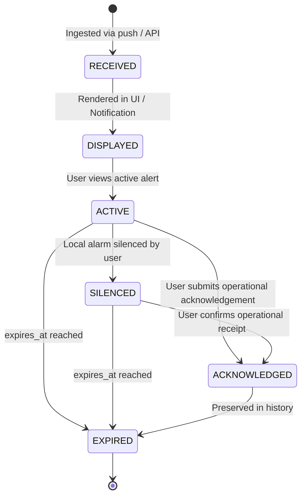

# SIH26001 Mobile Alert Contract Specification

## 1. Purpose & Architectural Boundaries

The SIH26001 Mobile Early-Warning application acts as an edge client consuming safety and hazard notifications produced upstream by the SIH26001 Risk Engine and Backend.

### Critical Operational Directives:
* **The mobile client NEVER calculates risk**: Landslide susceptibility, numerical risk scores, environmental parameter aggregations, and ML hazard inferences are performed exclusively on the backend Risk Engine.
* **Preserve Missing Data**: When upstream sensory, geographical, or ML fields are absent, the mobile app preserves `null` representations. Under no circumstances may numerical data be defaulted to `0` or placeholder values invented.
* **Identity & Deduplication**: The `alert_id` serves as the authoritative, unique identifier for every alert across ingestion, display, persistence, and synchronization.

---

## 2. JSON Wire Format Example

```json
{
  "alert_id": "ALT-2026-0908-001",
  "event_type": "landslide",
  "severity": "CRITICAL",
  "risk_score": 0.89,
  "location": {
    "name": "NH-58 Km 42 Slope Sector",
    "latitude": 30.1458,
    "longitude": 78.2982
  },
  "issued_at": "2026-09-08T18:30:00Z",
  "expires_at": "2026-09-08T22:30:00Z",
  "top_drivers": [
    "antecedent_rainfall_72h_high",
    "soil_saturation_threshold_exceeded",
    "slope_incline_gt_35deg"
  ],
  "recommended_action": "Evacuate immediately to designated high ground shelters. Avoid mountain pass road NH-58.",
  "affected_assets": [
    {
      "type": "road",
      "identifier": "NH-58"
    },
    {
      "type": "settlement",
      "identifier": "Rishikesh-Shivpuri Corridor"
    }
  ],
  "source": "SIH26001_ML_INFERENCE_PIPELINE_V2",
  "data_quality": "HIGH_CONFIDENCE",
  "requires_ack": true,
  "status": "ACTIVE"
}
```

---

## 3. Field Specification

| Field Name | Type | Requirement | Description |
| :--- | :--- | :--- | :--- |
| `alert_id` | String | **Required** | Globally unique identifier. Used for deduplication, state transitions, and history tracking. |
| `event_type` | String | **Required** | Hazard category (e.g., `"landslide"`). |
| `severity` | String | **Required** | Hazard severity level. Must be one of: `NORMAL`, `HIGH`, `CRITICAL`. |
| `risk_score` | Number (Double) | *Optional* | Backend-calculated risk score `[0.0, 1.0]`. If unavailable, remains `null` (never `0.0`). |
| `location` | Object | *Optional* | Object containing `name` (String?), `latitude` (Double?), and `longitude` (Double?). |
| `issued_at` | String (ISO-8601) | **Required** | UTC timestamp of issue (e.g., `2026-09-08T18:30:00Z`). |
| `expires_at` | String (ISO-8601) | *Optional* | UTC timestamp after which the alert automatically transitions to `EXPIRED`. |
| `top_drivers` | Array of Strings | *Optional* | Key causal factors identified by the Risk Engine. If missing, remains `null` (distinct from empty list). |
| `recommended_action`| String | *Optional* | Actionable guidance for civil defense and citizens. |
| `affected_assets` | Array of Objects | *Optional* | Key assets impacted (`road`, `settlement`). |
| `source` | String | *Optional* | Identifier of emitting service or model pipeline. |
| `data_quality` | String | *Optional* | Sensor/inference confidence flag. |
| `requires_ack` | Boolean | *Optional* | Indicates whether user acknowledgement is requested. Defaults to `false`. |
| `status` | String | *Optional* | Initial state on payload generation (`RECEIVED`, `ACTIVE`). |

---

## 4. Severity Definitions & Priority

| Severity | Operational Meaning | Notification Priority Channel (Phase 4+) |
| :--- | :--- | :--- |
| `NORMAL` | Advisory / Informational notice; no immediate threat. | Standard notification, silent or default tone. |
| `HIGH` | Elevated risk detected; conditions approaching critical thresholds. | High priority, prominent notification sound. |
| `CRITICAL` | Severe, imminent hazard; immediate evacuation / mitigation required. | Urgent notification channel, audible sound/vibration override where permitted. |

---

## 5. Alert Lifecycle States



### State Distinctions:
* **`SILENCED` vs `ACKNOWLEDGED`**:
  * `SILENCED` is a **local client UX event**. It halts local ringtone or vibration while keeping the alert active.
  * `ACKNOWLEDGED` is an **operational safety event**. It indicates verified receipt by personnel and must eventually be synced back to the backend. Silencing an alert NEVER marks it as acknowledged.
* **`EXPIRED`**: When the current system time exceeds `expires_at`, the alert is no longer visually presented as active, but remains preserved in persistent alert history.

---

## 6. Timestamp Handling

* All timestamps are standardized in **ISO-8601 UTC format** (e.g., `2026-09-08T18:30:00Z`).
* The mobile application parses timestamps into `java.time.Instant` instances.
* The application **never fabricates** timestamps; if `expires_at` is omitted, the alert remains active until explicitly revoked or acknowledged.

---

## 7. Deduplication & Data Integrity

1. **Primary Key**: All storage, in-memory collections, and list displays deduplicate on `alert_id`.
2. **Payload Validation**: Payloads with missing `alert_id`, missing or invalid `severity`, out-of-range coordinates (`[-90, 90]`, `[-180, 180]`), or unparseable timestamps fail validation safely and are logged without crashing the application.
3. **Safe Defaults**: Incomplete data structures do not trigger fallback calculations or artificial data synthesis.
